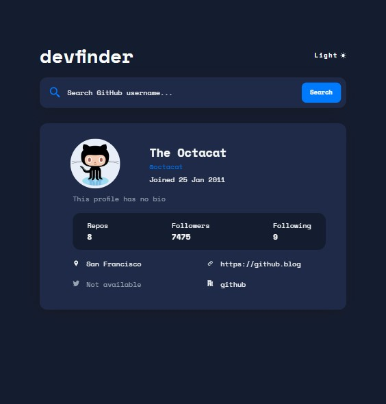

## Frontend Mentor - Github user search

---

#### Running the project

**Install** `npm install`

**Start** `npm start`

**Unit** tests `npm run test`

**E2E tests** Need to run `npm start` before beeing able to run `npm run cypress:open`

---

### Links

##### [Link to project Frontend Mentor](https://www.frontendmentor.io/challenges/github-user-search-app-Q09YOgaH6)

<!-- prettier-ignore -->
##### [Link to my solution](https://holmar-github-search.netlify.app/)

---

### Screenshots of my solution

#### Desktop version

 

  

#### Tablet version

 

  

#### Mobile version

 

 

---

### Screenshots of Frontend mentor's original solution

#### Desktop version

  

#### Tablet version

  

#### Mobile version

 

---
